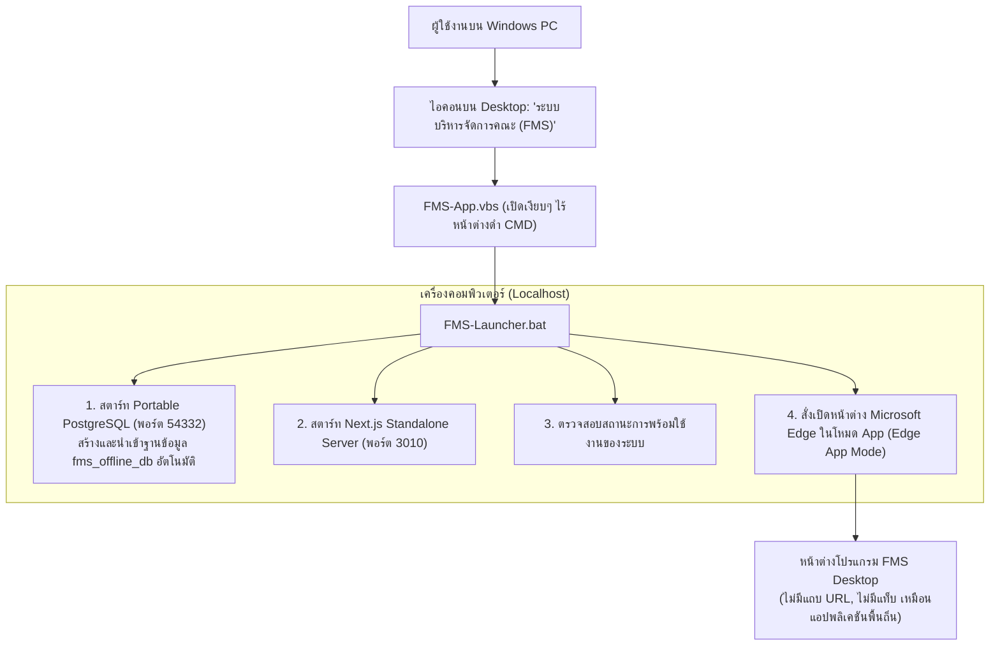

# คู่มือการแปลงและสร้างโปรแกรมติดตั้ง Windows (Desktop Offline App) สำหรับ FMS

คู่มือนี้สรุปสถาปัตยกรรมและขั้นตอนในการแปลงระบบบริหารจัดการคณะ (Faculty Management System - FMS) ให้เป็น **โปรแกรมสำหรับติดตั้งและใช้งานบนคอมพิวเตอร์ Windows PC โดยตรง (Standalone Offline Desktop Application)**

---

## 1. สถาปัตยกรรมของโปรแกรม (Desktop Architecture)

โปรแกรมได้รับการออกแบบให้ทำงานแบบ **All-in-One และ Offline 100%** โดยไม่ต้องต่ออินเทอร์เน็ต และไม่ต้องติดตั้งโปรแกรมอื่นเพิ่มเติมบนเครื่องของผู้ใช้งาน:



### ทำไมถึงเลือกใช้ Edge App Mode?
1. **ขนาดไฟล์เล็กและเบามาก**: ไม่ต้องดาวน์โหลดและฝัง Chromium Browser ขนาด 150-200MB เหมือน Electron
2. **ประหยัด RAM**: ใช้ทรัพยากรเครื่องน้อยมาก เปิดโปรแกรมได้รวดเร็วทันใจ
3. **มีอยู่แล้วใน Windows 10 และ Windows 11 ทุกเครื่อง**: ทำงานได้อย่างเสถียรและราบรื่นทันที

---

## 2. โครงสร้างไฟล์ในแพ็กเกจ (`dist/FMS-Windows-App`)

```
FMS-Windows-App/
├── app/                  # ไฟล์แอปพลิเคชัน Next.js Standalone (.next/standalone, static, public)
├── bin/
│   ├── node/             # Node.js Runtime (node.exe)
│   └── pgsql/            # Portable PostgreSQL (bin/, share/, lib/)
├── data/
│   ├── db/               # คลังข้อมูล PostgreSQL (สร้างและเก็บข้อมูลที่นี่)
│   └── fms_init.sql      # สคริปต์สร้างตารางและ Seed ข้อมูลเริ่มต้น
├── FMS-App.vbs           # ตัวเรียกเปิดโปรแกรมหลัก (เปิดแบบไม่มีหน้าต่าง CMD)
├── FMS-Launcher.bat      # สคริปต์ควบคุมการสตาร์ท Database และ Server
└── stop.bat              # สคริปต์สั่งปิดโปรแกรมและฐานข้อมูลอย่างปลอดภัย
```

---

## 3. ขั้นตอนการสร้างแพ็กเกจ (Build Steps)

### ขั้นตอนที่ 1: รันคำสั่งเตรียมแพ็กเกจอัตโนมัติ
เปิด Terminal ที่โฟลเดอร์โปรเจกต์ แล้วรันคำสั่ง:
```bash
npm run build:desktop
```
> คำสั่งนี้จะทำการ:
> 1. Build Next.js เป็น Standalone
> 2. คัดลอก Static Files, Public Assets และ Node.js Runtime
> 3. รวมคำสั่ง Migration SQL และข้อมูลเริ่มต้นไว้ที่ `data/fms_init.sql`
> 4. สร้างโครงสร้างทั้งหมดไว้ที่โฟลเดอร์ `dist/FMS-Windows-App/`

---

### ขั้นตอนที่ 2: วางไฟล์ Portable PostgreSQL
1. ดาวน์โหลด PostgreSQL Windows Binaries (ZIP) จาก [EnterpriseDB](https://www.enterprisedb.com/download-postgresql-binaries) (แนะนำเวอร์ชัน 16 หรือ 17)
2. แตกไฟล์ ZIP แล้วคัดลอกโฟลเดอร์ `bin/`, `lib/`, `share/` ไปวางไว้ที่:
   ```
   dist/FMS-Windows-App/bin/pgsql/
   ```

---

### ขั้นตอนที่ 3: ทดสอบเปิดใช้งานโปรแกรม
* ดับเบิลคลิกที่ไฟล์ `dist/FMS-Windows-App/FMS-App.vbs`
* ระบบจะทำการสร้างฐานข้อมูล และเปิดหน้าต่างโปรแกรม FMS ขึ้นมาทันที
* **บัญชีผู้ดูแลระบบตั้งต้น**:
  * **อีเมล:** `admin@app.local`
  * **รหัสผ่าน:** `Passw0rd!vibe`
* เมื่อต้องการปิดโปรแกรม: ดับเบิลคลิกที่ `stop.bat`

---

## 4. การสร้างตัวติดตั้ง Single-file Installer (`.exe`)

หากต้องการรวมไฟล์ทั้งหมดเป็นไฟล์ติดตั้งตัวเดียว เช่น `FMS-Faculty-System-Setup.exe` สำหรับแจกจ่ายให้ผู้ใช้นำไปกด Next -> Next -> Finish:

1. ติดตั้งโปรแกรมฟรี **[Inno Setup](https://jrsoftware.org/isdl.php)**
2. เปิดโปรแกรม Inno Setup Compiler แล้วเลือกเปิดไฟล์:
   ```
   desktop/inno-setup/setup.iss
   ```
3. กดปุ่ม **Compile** (หรือกดปุ่ม `F9`)
4. ตัวติดตั้ง `.exe` จะถูกสร้างขึ้นมาในโฟลเดอร์:
   ```
   dist/installer/FMS-Faculty-System-Setup.exe
   ```

### สิ่งที่ตัวติดตั้งจะทำให้ผู้ใช้งานอัตโนมัติ:
* ติดตั้งลงที่โฟลเดอร์ `C:\Program Files\FMS-Faculty-System` (หรือตามที่ผู้ใช้เลือก)
* สร้างไอคอนทางลัด **"ระบบบริหารจัดการคณะ (FMS)"** ไว้บน Desktop และใน Start Menu
* เมื่อผู้ใช้คลิกเปิดจาก Desktop โปรแกรมจะสตาร์ทฐานข้อมูลและเปิดหน้าต่างขึ้นมาให้อัตโนมัติ
* มีเมนูสำหรับสั่งปิดระบบ และมีระบบถอนการติดตั้ง (Uninstall) อย่างสะอาดหมดจด
