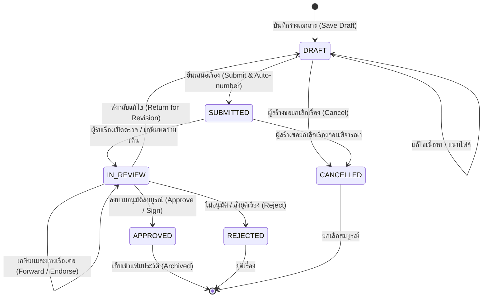

# Technical Architecture & Workflow Design
## Feature 4: ระบบบริหารจัดการและอนุมัติเอกสาร (E-Document & Approval Workflow)

---

## 1. โครงสร้างโฟลเดอร์ตาม Modular Monolith (Directory Structure)

```
src/
├── features/
│   └── documents/
│       ├── index.ts                      # Public Client API (DTOs, Types, Helpers)
│       ├── server.ts                     # Public Server API (Queries สำหรับ Server Components)
│       ├── actions.ts                    # Public Mutations (Server Actions)
│       ├── permissions.ts                # ประกาศสิทธิ์ DOCUMENTS_P และ DOCUMENTS_PERMISSIONS
│       ├── messages.ts                   # พจนานุกรม 2 ภาษา (TH/EN)
│       └── _internal/
│           ├── validations.ts            # Zod schemas สำหรับ payload validation
│           ├── services.ts               # Core database services, DTO mappers
│           ├── actions.ts                # Server action handlers ห่อด้วย runAction
│           └── numbering.ts              # ฟังก์ชัน Atomic Running Number Generator
│
├── app/
│   └── (admin)/
│       └── admin/
│           └── documents/
│               ├── page.tsx              # Server Component (ตรวจสิทธิ์, โหลดข้อมูลเริ่มต้น)
│               └── _components/
│                   ├── documents-client.tsx      # Main Admin Console (Dashboard & Tabs)
│                   ├── document-form-dialog.tsx  # โมดอลสร้าง/แก้ไขเอกสาร
│                   ├── routing-dialog.tsx        # โมดอลเกษียนหนังสือ / ส่งต่อ / อนุมัติ
│                   ├── document-detail-drawer.tsx# หน้าต่างแสดงรายละเอียดและไทม์ไลน์
│                   └── print-slip.tsx            # มุมมองพิมพ์ใบปะหน้าสารบรรณ
```

---

## 2. แผนผังเส้นทางและหน้าจอการใช้งาน (Route Mapping)

| Route Path | บทบาทการใช้งาน | การควบคุมการเข้าถึง (Access Control) |
| :--- | :--- | :--- |
| `/admin/documents` | แผงควบคุมระบบสารบรรณและอนุมัติเอกสาร (แท็บกล่องเข้า, ทะเบียน, งานรออนุมัติ) | ต้องล็อกอิน + สิทธิ์ `document:read` |
| `/admin/documents/[id]` | หน้ารายละเอียดเอกสารฉบับเต็ม พร้อมไทม์ไลน์การเกษียนหนังสือ | ต้องล็อกอิน + สิทธิ์ `document:read` (และตรวจสอบชั้นความลับ) |

---

## 3. ผังสถานะเอกสารและวงจรการอนุมัติ (State Machine & Workflow)



### คำอธิบายการเปลี่ยนสถานะ (Transitions):
1. **DRAFT → SUBMITTED**: ผู้สร้างกดยื่นเรื่อง ระบบจะทำการออกเลขสารบรรณอัตโนมัติตามประเภทและปี พ.ศ. และกำหนดผู้รับเรื่องคนแรก (`currentAssigneeId`)
2. **SUBMITTED / IN_REVIEW → IN_REVIEW**: ผู้พิจารณาทำการเกษียนข้อความ (Endorse) และเลือกผู้รับเรื่องในลำดับถัดไป (เช่น หัวหน้าภาค → รองคณบดี)
3. **IN_REVIEW → APPROVED**: ผู้มีอำนาจลงนามขั้นสุดท้าย (คณบดี) กดอนุมัติ ระบบจะบันทึกวันเวลาอนุมัติ (`approvedAt`) พร้อมประทับตราดิจิทัล
4. **IN_REVIEW → DRAFT (Return for edit)**: ส่งกลับพร้อมระบุข้อความสิ่งที่ต้องแก้ไข เอกสารจะกลับไปอยู่ในกล่องของผู้สร้างเพื่อแก้ไขและส่งใหม่

---

## 4. สิทธิ์ในระบบและการลงทะเบียน (Permissions & RBAC)

กำหนดสิทธิ์ใน `src/features/documents/permissions.ts`:

```ts
export const DOCUMENTS_P = {
  documentRead: "document:read",         // ดูรายการเอกสารที่ตนเกี่ยวข้อง
  documentCreate: "document:create",     // ร่างและยื่นเสนอเอกสาร
  documentEndorse: "document:endorse",   // เกษียนหนังสือและความเห็น
  documentApprove: "document:approve",   // ลงนามอนุมัติ/ไม่อนุมัติ
  documentManage: "document:manage",     // จัดการสารบรรณ ออกเลขทะเบียน และดูเอกสารทั้งหมด
} as const;
```

### การจับคู่สิทธิ์กับบทบาทในระบบ (Role-Permission Matrix):

| บทบาท (Role) | `document:read` | `document:create` | `document:endorse` | `document:approve` | `document:manage` |
| :--- | :---: | :---: | :---: | :---: | :---: |
| **Admin / Registrar (งานสารบรรณ)** | ✅ | ✅ | ✅ | ❌ | ✅ |
| **Executive (คณบดี / รองคณบดี)** | ✅ | ✅ | ✅ | ✅ | ❌ |
| **Department Head (หัวหน้าภาควิชา)** | ✅ | ✅ | ✅ | ❌ | ❌ |
| **General Staff / Faculty (อาจารย์/เจ้าหน้าที่)** | ✅ | ✅ | ❌ | ❌ | ❌ |

---

## 5. สถาปัตยกรรมออกเลขทะเบียนสารบรรณ (Atomic Numbering Service)

เพื่อรับประกันว่าจะไม่มีเลขทะเบียนสารบรรณซ้ำกันแม้ในสภาวะที่มีการยื่นเรื่องพร้อมกัน (High Concurrency):
1. ใช้ตาราง `document_sequences` ที่มี Primary Key ร่วม `(tenantId, docType, year)`
2. เรียกใช้ฟังก์ชัน `generateDocumentNumber` ภายใต้ `prisma.$transaction`:
   - ทำการ `UPSERT` แถวลำดับปัจจุบันพร้อมคำสั่ง `increment: 1`
   - นำลำดับที่ได้มาฟอร์แมตตามเทมเพลตของประเภทเอกสาร
   - บันทึกเลขสารบรรณลงในตัวเอกสารทันทีใน Transaction เดียวกัน
